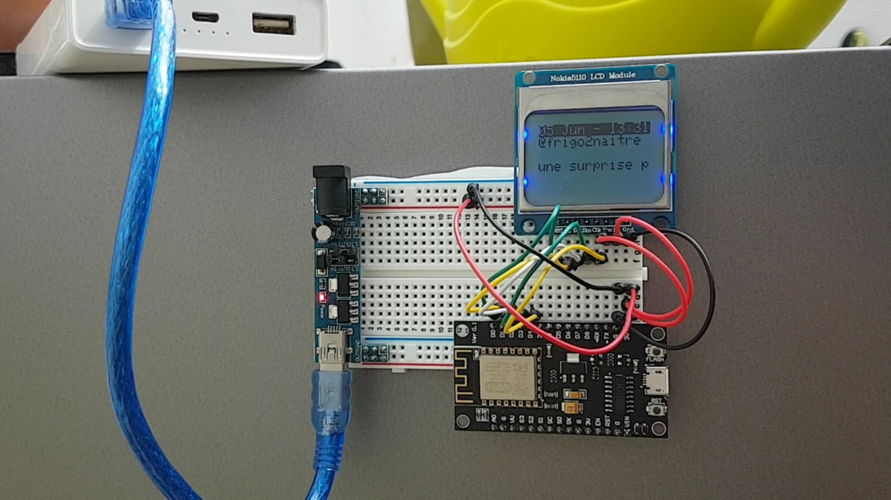

# Display tweets on a Nokia 5110 LCD with an ESP8266



## Assembly instructions

For this project you need the following devices:
- an ESP8266 (I am using NodeMCU),
- a Nokia 5110 LCD module,
- a 3V power supply,
- some wires.

Regarding the LCD, plug its pins as follows: 
- LCD RST -> ESP8266 D0
- LCD CE -> ESP8266 D1
- LCD DC -> ESP8266 D2
- LCD Din -> ESP8266 D3
- LCD CLK -> ESP8266 D4
- LCD Vcc -> 3V
- LCD BL -> 3V
- LCD Gnd -> Gnd

## Software dependencies

This software depends on few libraries:
1. [NTPClient](https://github.com/arduino-libraries/NTPClient) 3.2.0 from Fabrice Weinberg (install from IDE),
2. [GFX-Library](https://github.com/adafruit/Adafruit-GFX-Library) 1.8.4 from Adafruit (install from IDE), 
3. [PCD8544-Nokia-5110-LCD-library](https://github.com/adafruit/Adafruit-PCD8544-Nokia-5110-LCD-library) 1.2.0 from Adafruit (install from IDE),
4. [ArduinoJson](https://arduinojson.org/?utm_source=meta&utm_medium=library.properties) 6.15.2 from Benoît Blanchon (install from IDE),
5. [Time](https://playground.arduino.cc/code/time/) 1.6.0 from Michael Margolis (install from IDE),
6. Install the [Twitter Web API](https://github.com/dpertin/TwitterWebAPI) (install manually).

## Configuration

To run, this software requires some settings:
- Regarding Wifi (access point name (SSID) + password),
- Regarding the Over-The-Air (OTA) feature of the ESP8266,
- Regarding the Twitter API:
    - Follow the instructions to get credentials [here](https://github.com/dpertin/TwitterWebAPI#consumer-key-consumer-secret-access-token--access-token-secret),
    - A Twitter account to get the tweets from.

Most of the configuration is set in `config.h` and should be edited as follows:
```
$ mv config.h.sample config.h
$ vim config.h
```

## Acknowledgment

- debsahu for its [Twitter Web API](https://github.com/debsahu/TwitterWebAPI)

